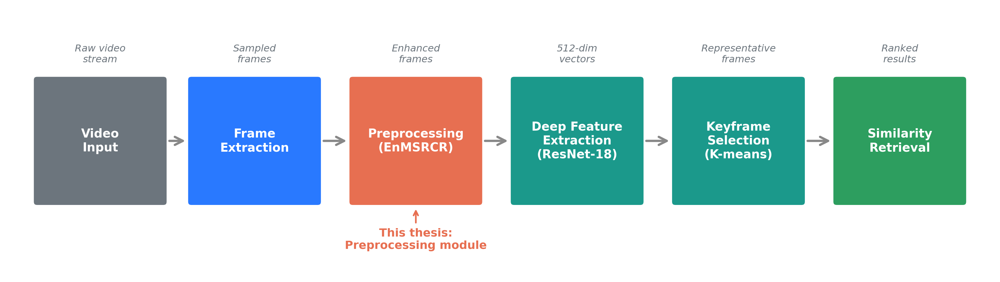
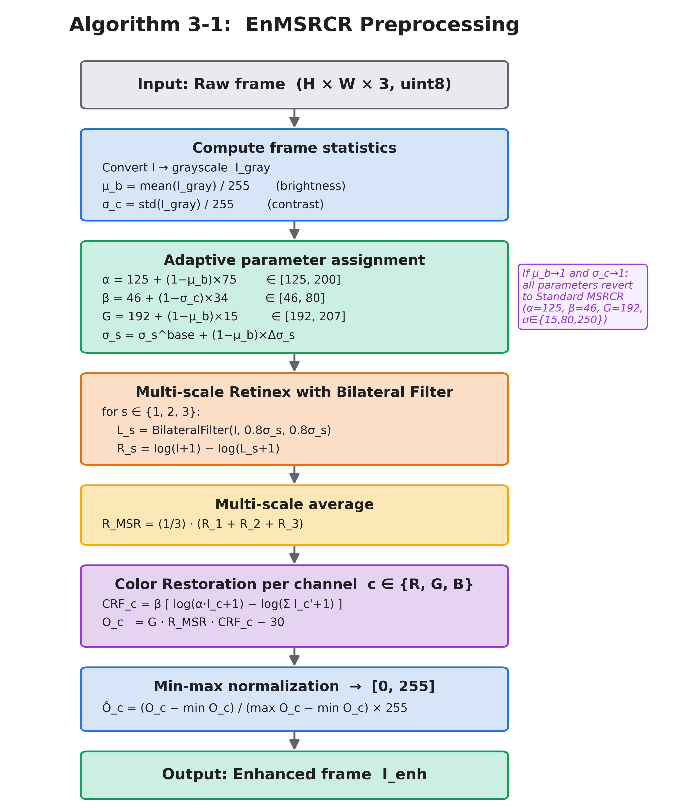
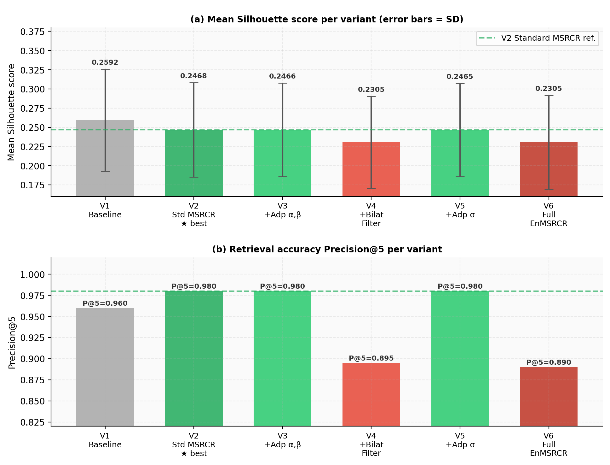
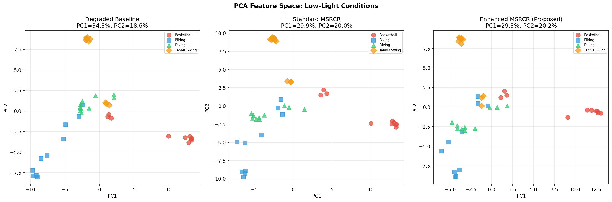
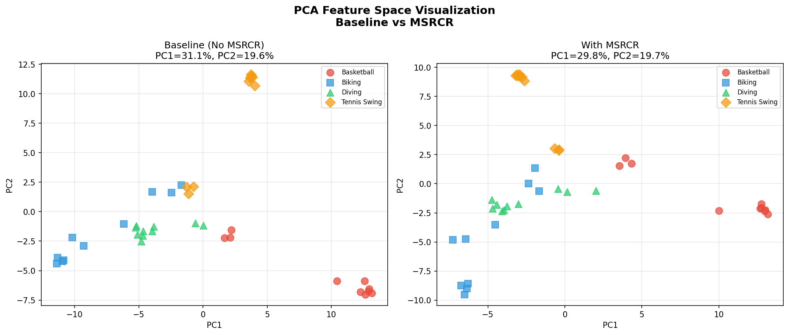

# EnMSRCR: Enhanced Multi-Scale Retinex for Video Content Retrieval

### Deep Learning-Based Video Content Retrieval with Adaptive Illumination Enhancement

---

## Undergraduate Thesis — Northwestern Polytechnical University (NPU)

**School of Mathematics and Statistics**

**Author:** Tsend-Ayush Ganbold  
**Advisor:** Prof. Wang Yong (王勇)

**Award:** Best Graduation Thesis Award, School of Mathematics and Statistics, Northwestern Polytechnical University (2026)

**Thesis Defense Score:** **95.3 / 100**

---

# Project Overview

This repository presents the research artifacts of my undergraduate thesis investigating whether **MSRCR-based illumination preprocessing** can improve the **stability and discriminability** of deep-feature keyframe selection in **Content-Based Video Retrieval (CBVR)** systems.

The proposed method, **EnMSRCR (Enhanced Multi-Scale Retinex with Color Restoration)**, extends the traditional MSRCR algorithm by introducing adaptive parameters based on image brightness and contrast characteristics.

The research combines **computer vision**, **image enhancement**, **deep learning**, and **statistical inference** to evaluate how illumination preprocessing influences downstream feature extraction and retrieval performance.

---

# Research Question

> **Can illumination enhancement improve deep feature-based video retrieval performance under challenging lighting conditions?**

---

# Complete Pipeline

```text
Video Frames
      ↓
EnMSRCR Illumination Enhancement
      ↓
ResNet-18 Feature Extraction
      ↓
K-means Keyframe Selection
      ↓
Similarity Retrieval & Evaluation
```

---

# Key Findings

| Result | Value |
|---|---|
| Clustering stability SD reduction (Standard MSRCR, normal lighting) | **40.8% improvement** (0.0669 → 0.0396) |
| Low-light Precision@5 recovery (Standard MSRCR, *f* = 0.4) | **0.960 → 0.980** |
| Bilateral Filter component effect | **Cohen's d = −0.741**, *p* < .001 |
| Adaptive parameter components | Statistically equivalent to Standard MSRCR (*p* > .79) |

---

## Main Insight

**MSRCR-based preprocessing significantly improves the reproducibility of clustering-based keyframe selection across independent runs without sacrificing retrieval accuracy.**

The six-variant ablation study further demonstrates that:

- Adaptive parameter tuning provides a safe and backward-compatible extension of Standard MSRCR.
- Bilateral-filter-based illumination estimation improves visual appearance but negatively affects downstream ResNet-18 feature discriminability.

---

# Pipeline Architecture

The proposed framework integrates illumination enhancement before deep feature extraction.

**Frame Extraction → Illumination Enhancement → ResNet-18 Feature Extraction → K-means Clustering → Similarity Retrieval**



---

# EnMSRCR Algorithm

Traditional MSRCR applies fixed parameters:

- α = 125
- β = 46
- σ ∈ {15, 80, 250}

These parameters cannot adapt to different illumination conditions.

EnMSRCR introduces adaptive parameter estimation using image brightness (μ_b) and contrast (σ_c).

## Adaptive Components

### 1. Adaptive α and β

Adjusts color restoration strength according to image illumination.

### 2. Bilateral Filter Illumination Estimation

Replaces Gaussian filtering while preserving edge information.

### 3. Adaptive Multi-scale σ

Automatically adjusts illumination estimation scales based on image characteristics.



---

# Six-Variant Ablation Study

A six-variant ablation study was conducted to evaluate the contribution of each adaptive component.

| ID | Variant | Observation |
|---|---|---|
| 1 | Baseline | Lower retrieval performance under low-light conditions |
| 2 | Standard MSRCR | Reference method |
| 3 | Adaptive α, β | Statistically equivalent (*p* = .844) |
| 4 | Bilateral Filter | **Significantly worse** (*d* = −0.741, *p* < .001) |
| 5 | Adaptive σ | Statistically equivalent (*p* = .796) |
| 6 | Full EnMSRCR | Performance influenced by Bilateral Filter limitations |



### Interpretation

The adaptive parameter components are safe extensions of Standard MSRCR.

However, Bilateral Filter-based illumination estimation suppresses texture information that ResNet-18 relies on for feature discrimination, illustrating that improved visual quality does not necessarily lead to improved retrieval performance.

---

# Feature Space Visualization

512-dimensional ResNet-18 feature representations were projected using PCA to visualize how preprocessing affects feature distributions under simulated low-light conditions.

Evaluated UCF11 categories:

- Basketball Shooting
- Biking
- Diving
- Tennis Swinging



### Additional Comparison under Normal Lighting



---

# Experimental Setup

## Dataset

**UCF11 (YouTube Action Dataset)**

- 40 video clips
- 4 action categories

## Deep Feature Extraction

- ResNet-18 (ImageNet Pretrained)
- Frozen 512-dimensional GAP Features

## Keyframe Selection

- K-means Clustering
- Automatic K Selection using Silhouette Score

## Evaluation Metrics

- Precision@5
- Silhouette Score
- Clustering Stability (Standard Deviation)

## Statistical Analysis

- Paired t-test
- Cohen's d Effect Size
- 95% Confidence Intervals
- One-way ANOVA
- Tukey HSD

## Development Environment

- Python 3.11
- PyTorch 2.9
- Windows 11
- Intel Core i5-1335U (CPU)

---

# Repository Structure

```text
enmsrcr-video-retrieval/
│
├── README.md
├── LICENSE
│
├── figures/
│   ├── 01_pipeline_architecture.png
│   ├── 02_enmsrcr_flowchart.png
│   ├── 03_ablation_results.png
│   ├── 04_pca_lowlight_visualization.png
│   └── 05_pca_normal_visualization.png
│
├── thesis/
│   └── Tsend_Ayush_Ganbold_Bachelor_Thesis_EnMSRCR.pdf
│
└── code/
    └── (implementation files - coming soon)
```

---


# Citation

If you use or reference this work, please cite:

> Tsend-Ayush, G. (2026). *Research on Video Content Retrieval Based on Deep Learning: An Empirical Study of MSRCR-Enhanced Keyframe Selection.* Bachelor's Thesis, Northwestern Polytechnical University, School of Mathematics and Statistics. Advisor: Prof. Wang Yong.

A follow-up journal manuscript based on this research is currently under preparation.

---

# Author

## Tsend-Ayush Ganbold

**B.Sc. in Statistics**  
Northwestern Polytechnical University (NPU)

Email: g.ayushts@gmail.com

LinkedIn: https://www.linkedin.com/in/tsenduayushi

### Technical Interests

- Data Analysis
- Machine Learning
- Computer Vision
- Statistical Modeling
- Deep Learning

---

# License

This project is released under the **MIT License**.

See the **LICENSE** file for additional details.
